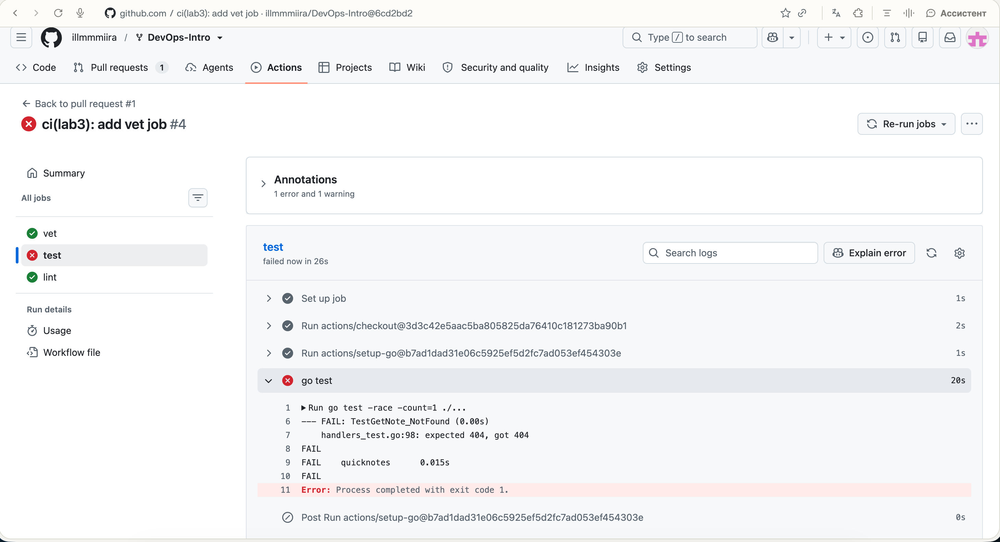
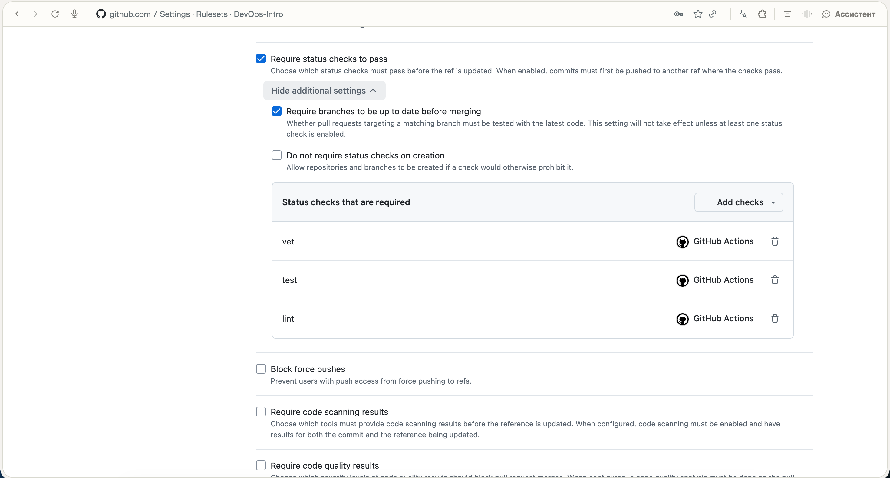
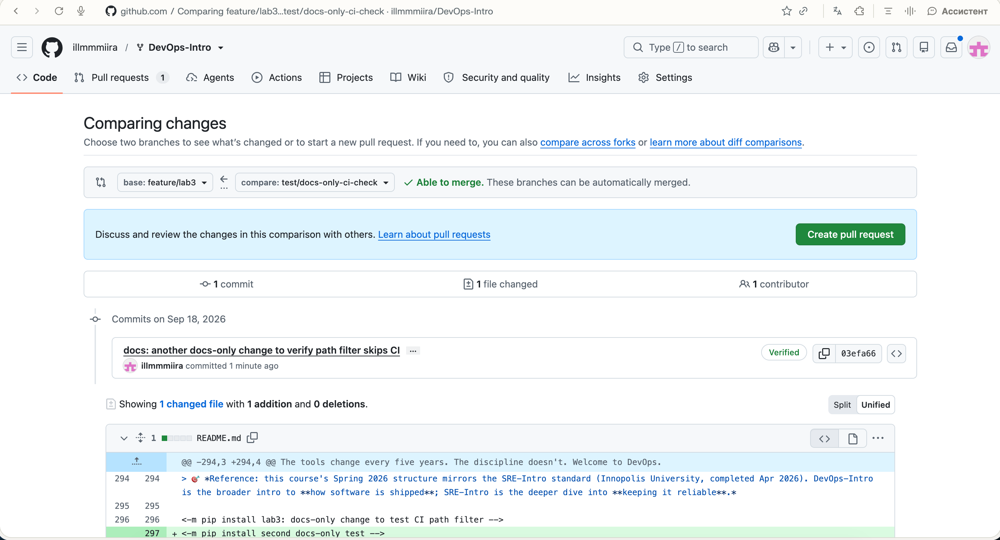

# Lab 3 — CI/CD: A PR-Gated Pipeline for QuickNotes

**Path chosen:** GitHub Actions — the repo already lives on GitHub and Labs 1–2 were done there, so it was the natural continuation.

**Submission PR (draft, targets the course repo):** https://github.com/inno-devops-labs/DevOps-Intro/pull/1583

**Note on that PR's checks:** GitHub does not run a brand-new workflow file that only exists on a fork branch when the PR targets a different (upstream) repository — it has to already exist on the base repo's default branch first. Since I can't push to `inno-devops-labs/DevOps-Intro:main`, the checks tab on #1583 stays empty even though the pipeline itself works correctly. I verified this by checking GitHub's own API directly (`check-runs` returns `total_count: 0` for that PR's commits, with zero check-suites ever created). To get real, visible CI runs while building the pipeline, I opened a second PR from `feature/lab3` into my own fork's `main` (`illmmmiira/DevOps-Intro#1`) — same branch, same commits, just without the cross-repo restriction. All links below point to real runs there.

---

## Task 1 — PR Gate

### CI file
`.github/workflows/ci.yml` — three jobs (`vet`, `test`, `lint`), pinned runner (`ubuntu-24.04`), every third-party action pinned by full commit SHA with a version comment, `permissions: contents: read`.

### Green run
https://github.com/illmmmiira/DevOps-Intro/actions/runs/35275276018 — all jobs pass (`vet`, `test`, `lint`, plus the `ci-ok` gate added in Task 2).

### Proof the gate blocks failures (Task 1.5)
I changed the expected status code in `TestGetNote_NotFound` from `http.StatusNotFound` to `http.StatusTeapot` (418) on purpose, committed, and pushed.

- Red state (commit `6cd2bd2`): `test` failed while `vet`/`lint` stayed green — the pipeline correctly isolated which check broke.
  
- Reverted the change (commit `9e7c885`) and confirmed everything went green again — see the green run link above ([35275276018](https://github.com/illmmmiira/DevOps-Intro/actions/runs/35275276018)).

### Branch protection (Task 1.6)
Updated my fork's ruleset `main-protection` (already had signed-commits/PR-required/linear-history from Lab 1) to also require status checks and "require branches up to date before merging". Screenshot below shows the ruleset right after Task 1.6, requiring the individual `vet`/`test`/`lint` checks. After adding the build matrix in Task 2.2, I replaced these three with just the aggregated `ci-ok` check, since matrix jobs get per-version check names (e.g. `vet (1.23)`) that would otherwise break this list.

### Design questions

**a) Why pin `ubuntu-24.04` instead of `ubuntu-latest`?**
`ubuntu-latest` is a moving target — GitHub can repoint it to a newer Ubuntu release at any time, and preinstalled tool versions can shift with it. That means CI can start failing with zero code changes on our side, and the failure is confusing to diagnose ("it worked yesterday"). Pinning to `ubuntu-24.04` keeps the environment stable until we deliberately choose to upgrade it.

**b) Why separate `vet`/`test`/`lint` into different jobs instead of one combined job?**
Separate jobs run in parallel, so the whole pipeline finishes faster than running the same three steps sequentially in one job. Just as important: each job reports its own pass/fail status, so a PR immediately shows *which* check failed (e.g. lint red, tests green) instead of one big red job you have to scroll through logs to diagnose. It also lets branch protection require them independently.

**c) What real attack does SHA-pinning actions prevent?**
Referencing an action by a mutable tag like `@v4` means whoever controls that tag (the maintainer, or an attacker who compromises their account) can push different code under the same tag, and every workflow using `@v4` immediately runs the new code with zero review. That's exactly what happened in the `tj-actions/changed-files` compromise in March 2025 — a compromised release dumped CI secrets into build logs across thousands of repos. Pinning to a full 40-character commit SHA means our workflow always runs the exact, reviewed code we chose, no matter what happens to the tag later.

**d) What is `permissions:` and what principle is it enforcing?**
It controls what the automatically-generated `GITHUB_TOKEN` is allowed to do during the run (read/write repo contents, issues, PRs, etc). Setting `contents: read` means the token can only read the repository — it can't push, can't modify releases, can't touch anything else — even if a step or a compromised third-party action tries to. This is the principle of least privilege: give the token exactly the access the job needs and nothing more, so a bug or a supply-chain compromise has the smallest possible blast radius.

---

## Task 2 — Make It Fast and Smart

### 2.1 Module cache
Added `cache-dependency-path: app/go.mod` to every `setup-go` step (the module lives in `app/`, not the repo root, so the default cache lookup couldn't find it and warned "Dependencies file is not found").

### 2.2 Build matrix
`vet` and `test` now run on Go 1.23 and 1.24 (`fail-fast: false`), reporting as `vet (1.23)`, `vet (1.24)`, etc. Added a `ci-ok` aggregation job (`needs: [vet, test, lint]`, `if: always()`) so branch protection only has to require one check name, immune to future matrix changes.

Note: `app/go.mod` originally required `go 1.24` as a minimum, which made every `1.23` matrix leg fail immediately with `go: go.mod requires go >= 1.24` — before `go vet`/`go test` even ran. Since the code itself is plain standard-library Go with nothing 1.24-specific, I lowered the `go` directive to `1.23` so the matrix is actually meaningful.

Branch protection updated to require only `ci-ok` instead of the now-renamed `vet`/`test`/`lint` checks.

### 2.3 Skip docs-only changes
Added `paths: ["app/**", ".github/workflows/ci.yml"]` under `on.pull_request`. Verified with a clean PR (`illmmmiira/DevOps-Intro#2`, `feature/lab3` ← a branch that *only* touched `README.md`, no `app/` files at all): GitHub's check-runs API reported `total_count: 0` for that commit — the workflow genuinely never triggered.

(First attempt at this test was inside the already-open PR #1, which didn't prove anything — GitHub's `pull_request` path filter compares the *whole PR's* cumulative diff against the base, not just the latest commit, and PR #1 already touched `app/` from earlier commits.)

### 2.4 Timing

| Scenario | Wall-clock time |
|---|---|
| No cache, single Go version, no path filter (commit `9e7c885`) | 25s |
| With module cache (commit `8480707`) | 29s |
| With cache + 1.23/1.24 matrix (commit `8047c92`) | 37s |

Times taken directly from GitHub's `check-runs` API (`started_at`→`completed_at` for each commit's run, jobs run in parallel so wall-clock = last job finished − first job started).

The cache made essentially no difference (25s → 29s is noise, not signal). This matches the lab's own prediction: `app/go.mod` has no `require` block at all — QuickNotes has zero third-party dependencies, so there's nothing for the Go module cache to actually save. The matrix run is longer only because `vet`/`test` now genuinely run twice (once per Go version), still in parallel with each other.

### Design questions

**f) Why cache `go.sum`-keyed inputs, not build outputs?**
`go.sum` pins the exact, verified version of every dependency, so a hash of it gives a cache key that only changes when dependencies actually change — safe and deterministic to reuse. Build outputs, by contrast, can legitimately differ between runs (different Go version in the matrix, different source code) — reusing a stale compiled artifact could hide a real compile error or produce a binary that doesn't match the current source, defeating the point of CI verifying the current code.

**g) What does `fail-fast: false` change, and when would you actually want `true`?**
With `fail-fast: false`, every matrix leg (Go 1.23, 1.24) runs to completion even if one fails, so we get full information from both instead of GitHub cancelling the rest — needed here to actually see whether a failure is version-specific. `fail-fast: true` (the default) cancels the remaining matrix jobs the moment one fails, saving runner time; that's the right choice when the matrix legs are essentially redundant (e.g. a flaky-test retry loop) and you don't need every leg's individual result.

**h) Risk of a malicious PR poisoning a cache that a protected branch later reads?**
Since anyone can open a PR from a fork, and their workflow run can populate the Actions cache, a malicious contributor could try to seed a cache entry under a key a later `main`-branch run would match, smuggling a tampered dependency or artifact into a "trusted" build without their code ever being merged or reviewed. GitHub's documented mitigation: caches created by a workflow run triggered from a fork pull request are isolated — that run can only *read* caches from the base repository, never *write* ones that base-repository branches (like `main`) will later restore. Only runs that execute directly on the base repository can write caches other base-repository runs will use.

---

## Final checklist

- [x] `.github/workflows/ci.yml` committed, all jobs present and pinned correctly
- [x] Green-run link, fail/fix evidence, branch-protection screenshot, design questions a–d
- [x] Branch protection requires `ci-ok`
- [x] Timing table for Task 2
- [x] PR opened: `feature/lab3` → `inno-devops-labs/DevOps-Intro` `main` (#1583)
- [ ] PR URL submitted via Moodle
